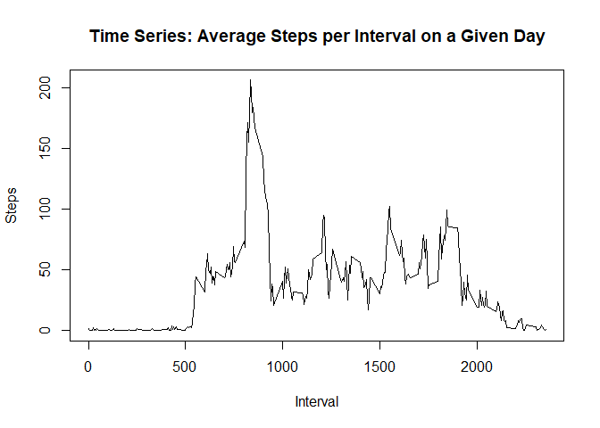
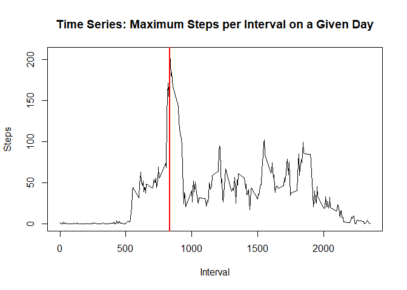
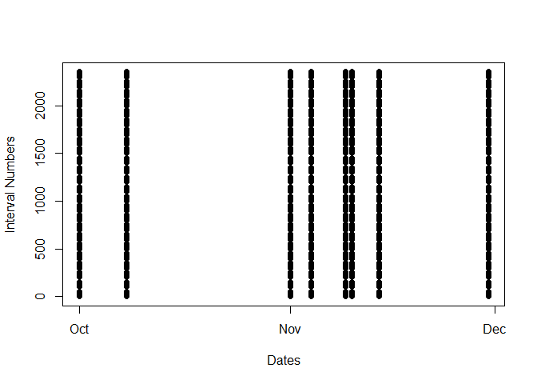
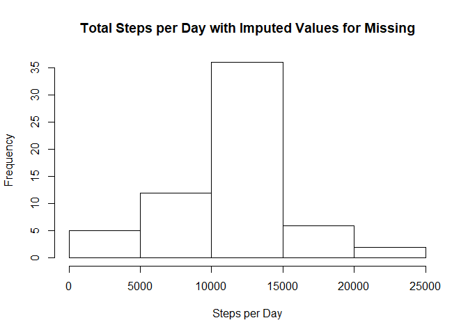
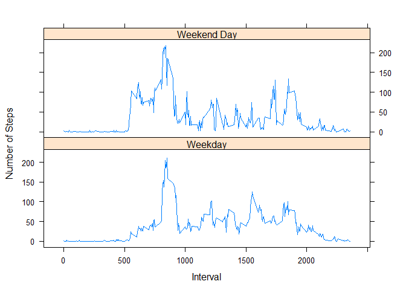

## Loading and preprocessing the data

We load in required library, set some global options, and read in the data to a dataframe called my usual default, "df." Then we have a look at the data set. 


```r
options(digits = 2, scipen = 9999)
library(chron)
```

```
## Warning: package 'chron' was built under R version 3.4.4
```

```r
library(lattice)
df <- read.csv("activity.csv", head = TRUE)
head(df, 10)
```

```
##    steps       date interval
## 1     NA 2012-10-01        0
## 2     NA 2012-10-01        5
## 3     NA 2012-10-01       10
## 4     NA 2012-10-01       15
## 5     NA 2012-10-01       20
## 6     NA 2012-10-01       25
## 7     NA 2012-10-01       30
## 8     NA 2012-10-01       35
## 9     NA 2012-10-01       40
## 10    NA 2012-10-01       45
```

- Format the dates in the dataframe.  


```r
df$date <- strptime(df$date, "%Y-%m-%d")
```

- Create a vector of dates.


```r
dates <- df$date
```

- Create a vector of unique dates.  


```r
uniqueDays <- unique(df$date)
```

- Create a vector of unique intervals.   


```r
uniqueInts <- unique(df$interval)
```

- Calculate the total number of unique dates.  


```r
totUniqueDays <- length(uniqueDays)
```

- Calculate the total number of unique intervals.  


```r
totUniqueInts <- length(uniqueInts)
```

- Create a list of unique days with their matching steps. That list contains what we need to calculate the total number of steps per day. 


```r
stepsDay <- split(df$steps, dates$yday)
```
 - Calculate the total number of steps per day.

```r
totStepsDay <- sapply(stepsDay, sum, na.rm=TRUE) 
```

We have 61 unique days and 288 unique intervals. 


## What is mean total number of steps taken per day?


```r
str(totStepsDay)
```

```
##  Named int [1:61] 0 126 11352 12116 13294 15420 11015 0 12811 9900 ...
##  - attr(*, "names")= chr [1:61] "274" "275" "276" "277" ...
```

```r
hist(totStepsDay, main = "Histogram of Total Steps per Day",
     xlab = "Steps per Day", ylab = "Frequency")
```

<!-- -->

```r
df$factInt <- as.factor(df$interval)
head(df$factInt)
```

```
## [1] 0  5  10 15 20 25
## 288 Levels: 0 5 10 15 20 25 30 35 40 45 50 55 100 105 110 115 120 ... 2355
```

```r
mnsteps <- mean(totStepsDay, na.rm = TRUE)
mdsteps <- median(totStepsDay, na.rm = TRUE)
```
- Mean total steps is 9354.23.  
- Median total steps is 10395.

## What is the average daily activity pattern?


```r
intData <- split(df$steps, df$interval)
avgStepsInt <- sapply(intData, mean, na.rm = TRUE)
plot(uniqueInts, avgStepsInt, type = "l",
     main = "Time Series: Average Steps per Interval on a Given Day",
     xlab = "Interval", ylab = "Steps")
```

<!-- -->

```r
maxInt = max(df$interval)
```

People start out slow on most days and stay slow until about interval 500. Then they start moving around more, with rapidly increasing numbers of steps until a very high peak of more than 200 steps per interval at interval 835. After that peak, number of steps drops down to a range of steps between about 25 and 100 that people seem to maintain until about interval 1900, at which point activity decreases until it reaches 0 at interval 2355. 


```r
maxIntDays <- max(avgStepsInt, na.rm=TRUE)
maxIndex <- as.numeric(which(avgStepsInt == maxIntDays))
maxInt <- uniqueInts[maxIndex]
plot(uniqueInts, avgStepsInt, type = "l",
     main = "Time Series: Maximum Steps per Interval on a Given Day",
     xlab = "Interval", ylab = "Steps")
abline(v=maxInt, col = "red", lwd = 2)
```

<!-- -->


The maximum average numbers of steps happens at interval 835 on a given day.

## Imputing missing values


The first question to answer is whether there is a pattern to the missing data that might suggest an appropriate way to impute the missing data. First, then, identify and pull out the missing cases and visualize them to see if there is any kind of pattern. 


```r
missings <- df[!complete.cases(df$steps),]
numMissing <- sum(is.na(df$steps))
str(missings)
```

```
## 'data.frame':	2304 obs. of  4 variables:
##  $ steps   : int  NA NA NA NA NA NA NA NA NA NA ...
##  $ date    : POSIXlt, format: "2012-10-01" "2012-10-01" ...
##  $ interval: int  0 5 10 15 20 25 30 35 40 45 ...
##  $ factInt : Factor w/ 288 levels "0","5","10","15",..: 1 2 3 4 5 6 7 8 9 10 ...
```

```r
plot(missings$date, missings$interval, ylab = "Interval Numbers", xlab = "Dates")
```

<!-- -->

Looks like the 2304 missing values are clustered on just a few days--but across all intervals for those days. Therefore, the means for those intervals should be good substitutions for the missing values. Now if I can only figure out where I put those means . . . .


```r
intMnSteps <- with(df, tapply(steps, df$interval, mean, na.rm = TRUE)) ##Calculate the means
missings$steps <- intMnSteps # Replace missing values
numMissingMissings <- sum(is.na(missings$steps)) ## Check it. 
```

Good enough. There are now 0 missing step values in what was a dataset made up entirely of step values. 

Now put the what-used-to-be-missing data into the data frame that we're going to make next, which will be a dataset of all *non*missing step values in the original data set. My blood sugar must be getting low because I can't believe I just wrote that. I'm not even sure it makes sense. 


```r
df2 <- na.omit(df) ## omit the missing values
numMissingdf2 <- sum(is.na(df2$steps)) ## Check it
df2 <- rbind(df2, missings)
df2 <- df2[order(df2$date), ]
totMissingAfterAllThat <- sum(is.na(df2$steps))
```

After creating a dataset with 0 missing values in it, we put the two data sets together and check for missing values. There are 0 of them. Excellent. 

Recycle the default "df" dataframe name and reuse the code from above. 


```r
df <- df2
df$date <- strptime(df$date, "%Y-%m-%d")
dates <- df$date
uniqueDays <- unique(df$date)
uniqueInts <- unique(df$interval)
totUniqueDays <- length(uniqueDays)
totUniqueInts <- length(uniqueInts)
steps <- split(df$steps, dates$yday)
totStepsDay <- sapply(steps, sum, na.rm=TRUE)
str(totStepsDay)
```

```
##  Named num [1:61] 10766 126 11352 12116 13294 ...
##  - attr(*, "names")= chr [1:61] "274" "275" "276" "277" ...
```

```r
hist(totStepsDay, main = "Total Steps per Day with Imputed Values for Missing",
     xlab = "Steps per Day", ylab = "Frequency")
```

<!-- -->

I like the shape of those data. 


```r
df2mnsteps <- mean(totStepsDay, na.rm = TRUE)
df2mdsteps <- median(totStepsDay, na.rm = TRUE)
meandiff <- df2mnsteps - mnsteps
meddiff <- df2mnsteps - mdsteps
```

- We *used* to have a mean of 9354.23. Our new mean total steps is 10766.19, a difference of 1411.96.   
- Median total steps *was* 10395. Now it's 10766.19, the same as the mean.  That's a difference of 371.19. The mean and the median are the same because we used the mean to replace missing the missing values. There are so many means with that exact value that the value became the median.  
- Most importantly, the data look a lot more parametric.

## Are there differences in activity patterns between weekdays and weekends?
First we mess around until the data are in the format we need for the analysis. Create a new variable with day-of-the-week information it, set it to 0 in all cases, then set it to 1 for weekdays. The remainder should be weekends, but actually I'm not thrilled with that logic. 

We know the data set has no missing steps because we imputed the men for missing steps. So let's check for missing dates, just in case. 


```r
missdate <- sum(is.na(df$date))
```

There are 0 of them. 


```r
dates <- df$date
df$wkdays <- dates$wday 
summary(df$wkdays)
```

```
##    Min. 1st Qu.  Median    Mean 3rd Qu.    Max. 
##       0       1       3       3       5       6
```

```r
df$isWeekend <- is.weekend(df$wkdays)
summary(df$isWeekend)
```

```
##    Mode   FALSE    TRUE 
## logical   12384    5184
```

```r
weekendDays <- sum(df$isWeekend)
weekDays <- length(dates) - weekendDays
```

So we have 12384 weekdays and 5184 weekend days. Sounds reasonable enough. 

Make the weekday - weekend factor variable. 


```r
df$dayType <- ifelse(df$isWeekend == "FALSE", df$dayType <- "Weekday", df$dayType <- "Weekend Day")
df$dayType <- as.factor(df$dayType)
summary(df$dayType)
```

```
##     Weekday Weekend Day 
##       12384        5184
```


```r
stepsPerDay <- aggregate(steps ~ interval + dayType, data = df, mean)
names(stepsPerDay) <- c("interval", "dayType", "steps")
```


```r
xyplot(steps ~ interval | dayType, stepsPerDay, type = "l", layout = c(1, 2), 
    xlab = "Interval", ylab = "Number of Steps")
```

<!-- -->
